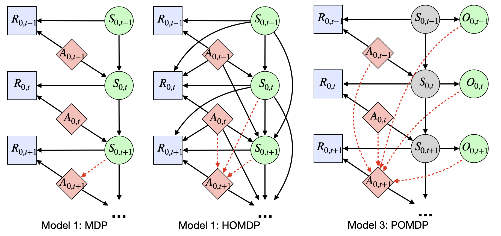

# TestMDP: Does the Markov Decision Process Fit the Data: Testing for the Markov Property in Sequential Decision Making

This repository contains the implementation for the paper "Does the Markov Decision Process Fit the Data: Testing for the Markov Property in Sequential Decision Making" (ICML 2020) in Python.

## Summary of the paper

The Markov assumption (MA) is fundamental to the empirical validity of reinforcement learning. In this paper, we propose a novel Forward-Backward Learning procedure to test MA in sequential decision making. The proposed test does not assume any parametric form on the joint distribution of the observed data and plays an important role for identifying the optimal policy in high-order Markov decision processes and partially observable MDPs. We apply our test to both synthetic datasets and a real data example from mobile health studies to illustrate its usefulness.

## Requirements
Run `conda env create --file TestMDP.yml` to create the Conda environment and then run `conda activate TestMDP` to activate the environment.

## File Overview
1. Files in the main folder: scripts for reproducing results. 
2. Files in the `/code` folder: main functions for the proposed test, our experiments and some supporting functions.
    1. The proposed test
        1. `_core_test_fun.py`: main functions for the proposed test, including Algorithm 1 and 2 in the paper, and their componnets.
        5. `_QRF.py`: the random forests regressor used in our experiments.
    2. Experiments
        2. `_DGP_Ohio.py`: simulate data and evaluate policies for the HMDP synthetic data section.
        3. `_DGP_TIGER.py`: simulate data for the POMDP synthetic data section.
        7. `_utility_RL.py`: RL algorithms used in the experiments, including FQI, FQE and related functions.
    6. helper functions: `_uti_basic.py` and `_utility.py`

## How to reproduce results
Simply run the corresponding scripts:

1. Figure 2: `Ohio_simu_testing.py`
2. Figure 3: `Ohio_simu_values.py` and `Ohio_simu_seq_lags.py`
3. Figure 4: `Tiger_simu.py`
